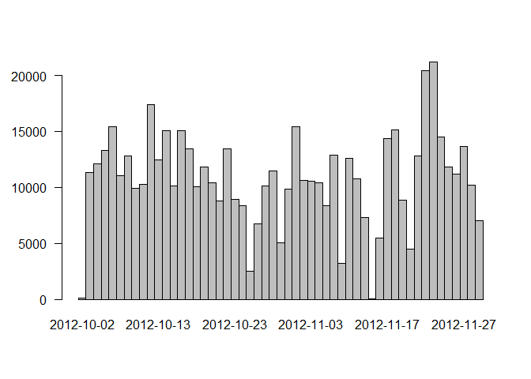
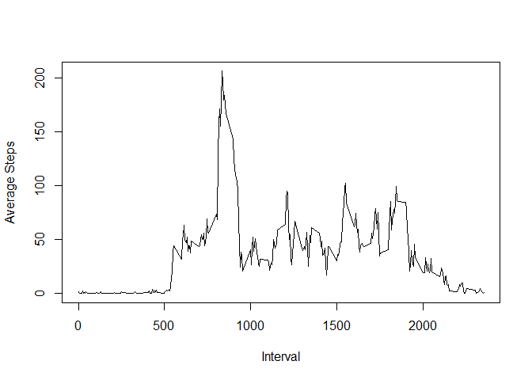
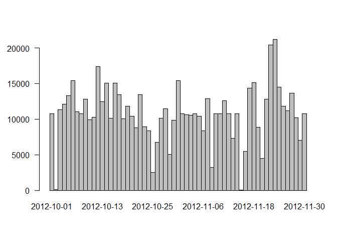

# Reproducible Research: Peer Assessment 1
Alex Carr  


## Loading and preprocessing the data

```r
library(plyr)
library(lattice)
activity=read.csv("activity.csv")
pact=na.omit(activity)
```


## What is mean total number of steps taken per day?

```r
stepsaday=aggregate(pact$steps, list(pact$date), sum)
x = stepsaday[,2]
names(x) =stepsaday[,1]
barplot(x, las = 1, space = 0)
```

 

```r
print(paste("The mean steps per a day is:", mean(stepsaday[, 2])))
```

```
## [1] "The mean steps per a day is: 10766.1886792453"
```

```r
print(paste("The median steps per a day is:", median(stepsaday[, 2])))
```

```
## [1] "The median steps per a day is: 10765"
```


## What is the average daily activity pattern?

```r
intervalstepmean=aggregate(pact$steps,list(pact$interval),mean)
names(intervalstepmean)=c("Interval","Average Steps")
plot(intervalstepmean,type="l")
```

 

```r
print(paste("The interval with the highest mean steps across all days is:", intervalstepmean[which.max(intervalstepmean[,2]),1]))
```

```
## [1] "The interval with the highest mean steps across all days is: 835"
```

## Imputing missing values

```r
print(paste("The number of rows with missing data is:", nrow(activity[is.na(activity),])))
```

```
## [1] "The number of rows with missing data is: 2304"
```

```r
impute.mean <- function(x) replace(x, is.na(x), mean(x, na.rm = TRUE))
pact2=ddply(activity, ~ interval, transform, steps = impute.mean(steps))

stepsaday2=aggregate(pact2$steps, list(pact2$date), sum)
x = stepsaday2[,2]
names(x) =stepsaday2[,1]
barplot(x, las = 1, space = 0)
```

 

```r
print(paste("The mean steps per a day is:", mean(stepsaday2[, 2])))
```

```
## [1] "The mean steps per a day is: 10766.1886792453"
```

```r
print(paste("The median steps per a day is:", median(stepsaday2[, 2])))
```

```
## [1] "The median steps per a day is: 10766.1886792453"
```

```r
print("Does not appreciably change mean or median as expected since we are using mean steps per an interval as the imputed value. The main difference for total steps in a day is imputing a vaule for missing days.")
```

```
## [1] "Does not appreciably change mean or median as expected since we are using mean steps per an interval as the imputed value. The main difference for total steps in a day is imputing a vaule for missing days."
```


## Are there differences in activity patterns between weekdays and weekends?

```r
df=pact2
df$Day_Flag=weekdays(as.Date(pact2[,2]))
df$Weekend_Flag="weekday"
df$Weekend_Flag[df$Day_Flag=="Saturday"]="weekend"
df$Weekend_Flag[df$Day_Flag=="Sunday"]="weekend"
intervalstepmean2=aggregate(df$steps,list(df$interval,df$Weekend_Flag),mean)
names(intervalstepmean2)=c("Interval", "Weekend_Flag","Number of steps")
xyplot(`Number of steps`~Interval|Weekend_Flag,data=intervalstepmean2,type="l",layout=c(1,2))
```

 

